# Cav3D Studio 操作マニュアル

（2026-10-04 版。座標系は Z が上、長さの単位は mm）

**Cav3D Studio**は、空洞共振器や導波管部品の形を 3D CAD で作り、その場で電磁界解析まで行うデスクトップアプリです。
解析は 3 次元有限要素コード **Cavity3D-FEM**（2 次 Nédélec 要素・曲線四面体）で行い、共振周波数・Q 値・電磁場、
S パラメータ、1 ポート空洞の共振点と外部 Q を求められます。

目次:
[1. はじめに](#1-はじめに) /
[2. インストールと起動](#2-インストールと起動) /
[3. 画面の見方](#3-画面の見方) /
[4. チュートリアル 1: 円柱空洞の共振モード](#4-チュートリアル-1-円柱空洞の共振モード) /
[5. チュートリアル 2: スケッチと回転でビームパイプ付き空洞を作る](#5-チュートリアル-2-スケッチと回転でビームパイプ付き空洞を作る) /
[6. チュートリアル 3: 導波管に結合した空洞の S パラメータと共振探索](#6-チュートリアル-3-導波管に結合した空洞の-s-パラメータと共振探索) /
[7. スケッチ](#7-スケッチ) /
[8. 3D モデル](#8-3d-モデル) /
[9. プロジェクトとファイル](#9-プロジェクトとファイル) /
[10. 物理（材料と境界条件）](#10-物理材料と境界条件) /
[11. メッシュ](#11-メッシュ) /
[12. 解析の設定と実行](#12-解析の設定と実行) /
[13. 結果を見る](#13-結果を見る) /
[14. 書き出し](#14-書き出しcsv--vtk--touchstone--フィールドマップ) /
[15. 困ったとき](#15-困ったとき) /
[付録](#付録)

---

## 1. はじめに

### できること

- **形を作る**: 2D スケッチ（拘束・寸法付き）→ 押し出し・回転、直方体・円柱・球、フィレット・面取り・シェル・結合・
  ミラー。他の CAD の STEP / IGES / BREP も取り込めます。寸法を変えると形がそのまま作り直されます。
- **固有モード解析**: 閉じた空洞の共振周波数、壁損失と誘電体損失（tanδ）による Q 値、電磁場（蓄積エネルギー 1 J に
  規格化）。
- **ポートスイープ**: 導波管ポート・同軸ポートを付けた構造の S パラメータを周波数の範囲で計算（適応スイープで高速に）。
  指定した周波数の電磁場（スナップショット）も見られます。
- **共振探索**（ポートが 1 つの空洞: カプラー空洞など）: 共振周波数 f0、外部 Qe、内部 Q0、負荷 QL、結合係数 β。
- **書き出し**: CSV・VTK（ParaView）・Touchstone（.sNp）、規則格子の電磁場（フィールドマップ。ビーム計算用）。

### 作業の流れ

リボン（画面上部）のタブは、作業の順に並んでいます。

| 1. モデリング | 2. 物理 | 3. メッシュ | 4. 解析 | 5. 結果 |
|---|---|---|---|---|
| 形を作る | 領域名・材料、境界条件 | メッシュを作って要素数・品質を確認（省略可） | 解析の種類・ソルバーを決めて実行 | 周波数・Q・場、S パラメータ図 |

- **領域名（材料）と境界条件はメッシュに書き込まれます。** メッシュを作る前に「物理」タブで決めておくと、
  メッシュタブで作ったメッシュが解析にそのまま使われます（後から変えると、解析実行のときにメッシュを作り直します）。
- メッシュタブでメッシュを作るのは省略できます（解析実行のときに作られます）。
- 作ったもの・設定・解析結果は、すべて 1 つの **プロジェクト**（`*.cv3dproj`）に入ります（[9 章](#9-プロジェクトとファイル)）。

### 用語

| 用語 | 意味 |
|---|---|
| ボディ | 3D の立体 1 つ。解析では**電磁場が存在する領域**（真空・誘電体）。金属はモデル化しません（ボディの外側が金属） |
| 領域 | 解析から見たボディ。名前（領域名 = ボディの名前）と比誘電率 εr・比透磁率 μr を持ちます。材料の違う部分は別のボディにします |
| 境界条件 | ボディの面に付ける条件。割り当てていない外面はすべて **PEC**（金属壁）。ほかに E-short・M-short（対称面）・ポート |
| フィーチャー | 形を作る 1 つ 1 つの操作（スケッチ・押し出し・フィレット…）。作った順に記録され、途中を直すと後ろが作り直されます |
| 結果 | 解析 1 回分。プロジェクトに番号付きで全部残ります |

## 2. インストールと起動

### 配布版（Cav3D-Studio.exe）

動作環境: Windows 10 / 11（64 ビット）、メモリ 8 GB 以上を推奨、OpenGL 3.2 以上のグラフィックス（3D 表示に使います。
リモートデスクトップや一部の仮想マシンでは使えないことがあります）。インストールや管理者権限は要りません。

1. 配布ページ（https://github.com/TakuyaNatsui/Cav3D-Studio/releases）から `Cav3D-Studio-<版>-trial-win64.zip` を
   ダウンロードします（`SHA256SUMS.txt` の値で確かめられます: `certutil -hashfile <zip> SHA256`）。
2. zip をローカルのフォルダ（例: `C:\Cav3D-Studio`）に展開します。ファイル数が多いので、クラウドで同期される
   フォルダ（OneDrive など）は避けてください。
3. 展開したフォルダの `Cav3D-Studio.exe` を実行します。「Windows によって PC が保護されました」と出たら、
   **詳細情報** → **実行** を押します（EXE にまだコード署名が無いため）。

- フォルダには、使用許諾（`EULA.ja.txt` / `EULA.en.txt`）、同梱物のライセンス（`THIRD_PARTY_NOTICES.txt`）、
  このマニュアル（`docs\`）、メッシュ生成のプログラム（`mesher\`。GPL のもとで配布する別のプログラム）が入っています。
- 版の確認: コマンドプロンプトで `Cav3D-Studio.exe version`。
- 解析とメッシュ生成は別のプロセスで動くので、計算中も画面は固まらず、計算が失敗してもアプリは落ちません。
- コマンドラインでも同じ解析ができます（[付録 C](#c-コマンドライン)）。

### 試用版

試用版（ウィンドウの題名に「（試用版）」）は、**要素数（四面体の数）が 10,000 以下のメッシュだけ解析できます**。
ほかの機能（モデリング、メッシュの生成、結果の表示・書き出し）は製品版と同じです。

- 上限を超えるメッシュは、生成はできますが、解析（固有モード・ポートスイープ・スナップショット・共振探索、
  コマンドラインの `run-cavity` / `run-driven`）を始める前に止まり、ログに上限と要素数が出ます。
  メッシュタブの統計にも赤字で出ます。メッシュサイズを大きくして要素を減らしてください。
- 2 次の曲線要素は精度が高いので、10,000 要素でも単純な空洞なら十分な精度が出ます
  （チュートリアル 1 の円柱は約 1,300 要素で解析解と 0.1 % 以内）。
- 版の確認: `Cav3D-Studio.exe version`

## 3. 画面の見方

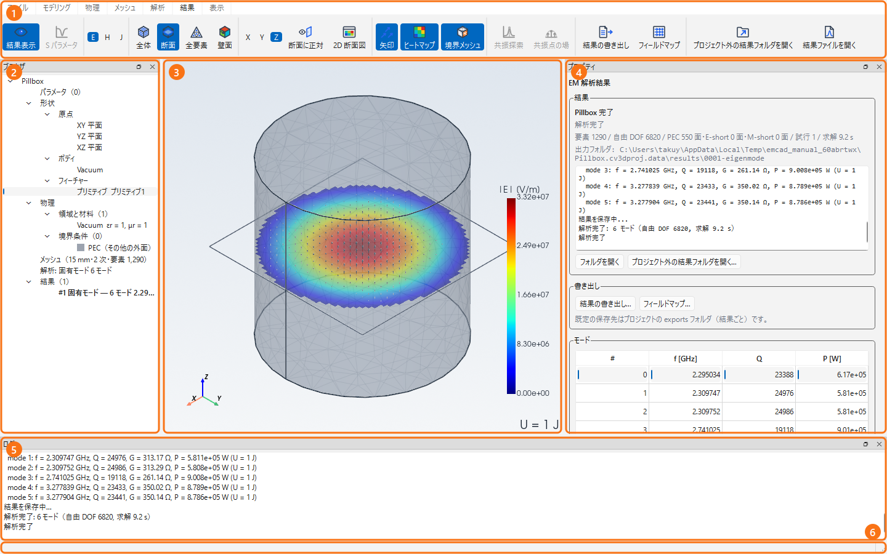

| | 領域 | 役割 |
|---|---|---|
| 1 | **リボン** | 操作のボタン。タブ「ファイル」「モデリング」「物理」「メッシュ」「解析」「結果」「表示」。ボタンにマウスを乗せると、名前・ショートカット・説明が出ます |
| 2 | **ブラウザ** | プロジェクトの中身: パラメータ / 形状（原点平面・ボディ・フィーチャー）/ 物理（領域と材料・境界条件）/ メッシュ / 解析 / 結果（解析の履歴） |
| 3 | **3D ビュー** | モデルと解析結果の表示。面・エッジ・ボディをクリックで選びます。スケッチの編集中は 2D のスケッチ画面になります |
| 4 | **プロパティ** | リボンのタブに合わせて切り替わります: モデリング = 選んだものの情報とフィーチャーの入力欄（スケッチ編集中はスケッチの設定）、物理 = 領域と材料・境界条件、メッシュ = メッシュの設定と統計、解析 = 解析の種類とソルバー、結果 = 結果と表示の設定（「ファイル」「表示」タブでは直前のまま） |
| 5 | **ログ** | メッシュ生成・解析の進み具合、エラー |
| 6 | **ステータスバー** | いまの道具の使い方、マウスの下の面やエッジ |

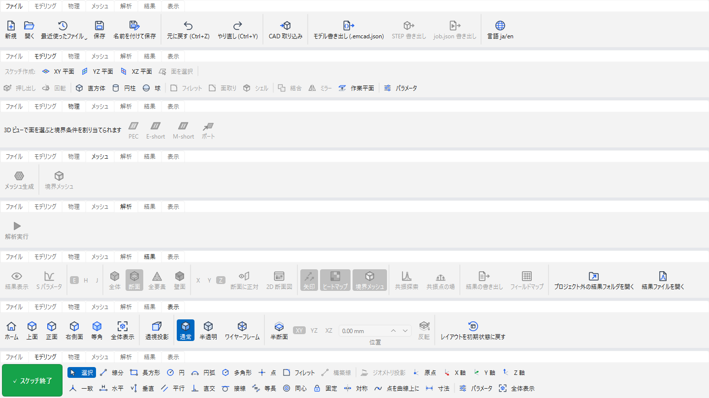

リボンの全ボタンの一覧（アイコン・名前・説明）は [manual/ribbon_buttons.md](manual/ribbon_buttons.md) にあります。

### 3D ビューの操作

| 操作 | 動作 |
|---|---|
| 左ドラッグ | 回転 |
| 中ドラッグ（Shift + 中ドラッグで回転） | 平行移動 |
| 右ドラッグ / ホイール | 拡大・縮小 |
| 左クリック | 選択（Shift + クリックで追加、Ctrl + クリックでエッジのループをまとめて選択） |
| Esc | 選択の解除、面の選択待ちや入力のキャンセル |
| F | 全体表示 |

3D ビューとスケッチ画面は、マウスを乗せるとキー入力（F・Esc・スケッチの L / R / C …）を受け取ります
（入力欄で文字を打っている最中は横取りしません）。どのタブを開いていても **Ctrl+Z / Ctrl+Y**（元に戻す / やり直し）、
**Ctrl+N / Ctrl+O / Ctrl+S / Ctrl+Shift+S**（新規 / 開く / 保存 / 名前を付けて保存）が使えます。

### 表示タブ

- **ホーム・上面・正面・右側面・等角・全体表示**: 視点を切り替えます（正面 = −Y から XZ 面、右側面 = +X から YZ 面）。
- **透視投影**: オンで遠近感のある表示、オフ（既定）で平行投影（奥の物体も同じ大きさ）。
- **レイアウトを初期状態に戻す**: ブラウザ・プロパティ・ログの配置と、別ウィンドウ（S パラメータ図・2D 断面図）の
  位置を初めの状態に戻します。ウィンドウの大きさ・ドックの配置・別ウィンドウの位置は、閉じたときの状態を
  次の起動でも再現します（ドックはタイトルをドラッグで動かしたり、切り離したりできます）。

### ブラウザの操作

| 項目 | クリック | ダブルクリック / 右クリック |
|---|---|---|
| 節（パラメータ・形状・物理・メッシュ・解析・結果） | 対応するタブへ | 開く / 畳む |
| 原点平面（XY / YZ / XZ） | モデリングタブへ | その平面でスケッチを始める |
| ボディ | 3D で選択（もう一度で解除）。ツールチップに体積 | 名前の変更（= 領域名。[10 章](#ボディと領域名)） |
| フィーチャー | 右に詳細（エラーは赤字と ⚠、抑制中は灰色） | 編集（スケッチはスケッチ編集へ） |
| 領域（物理 > 領域と材料） | 物理タブへ、そのボディを選択 | 名前の変更 |
| 境界条件（物理 > 境界条件） | 物理タブへ、その面を 3D で強調 | |
| 結果の各項目 | その結果を表示 | 右クリック: 名前の変更・フォルダを開く・削除 |

### 言語

「ファイル」タブの **言語 ja/en** で日本語と英語を切り替えます（次の起動にも引き継ぎます）。リボン・ブラウザ・
ツールチップはすぐに切り替わり、右パネルの見出しなど一部は次の起動から切り替わります。

## 4. チュートリアル 1: 円柱空洞の共振モード

半径 50 mm、長さ 100 mm の円柱空洞（ピルボックス）の共振モードを求めます。最も低い TM010 モードの周波数は
解析解で 2.2949 GHz です。所要時間は 1 分ほどです。

**1. 円柱を作る** — 「モデリング」タブの **円柱**。右のプロパティに入力欄が出るので、半径 `50`、高さ `100` と入れます
（操作は「新規ボディ」のまま）。3D ビューに緑色でプレビューが出ます。**OK**。

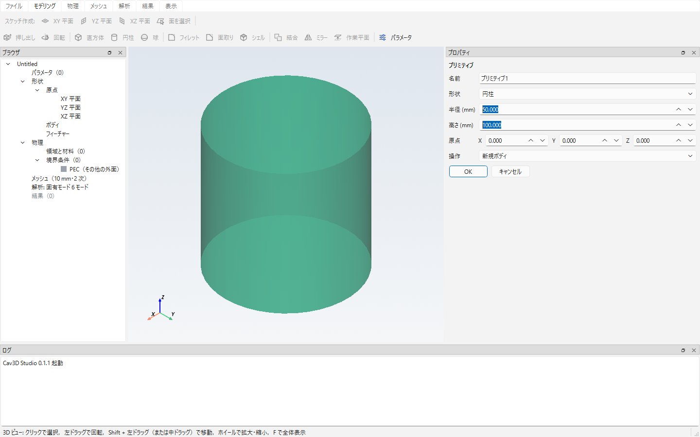

**2. 領域名を決める** — 「物理」タブ。右の「領域（ボディ）と材料」の表で、領域名 `Body1` をダブルクリックして
`Vacuum` に変えます（εr = μr = 1 のまま。ブラウザのボディのダブルクリックでも変えられます）。境界条件は何もしません
（外面はすべて金属壁 PEC になります）。

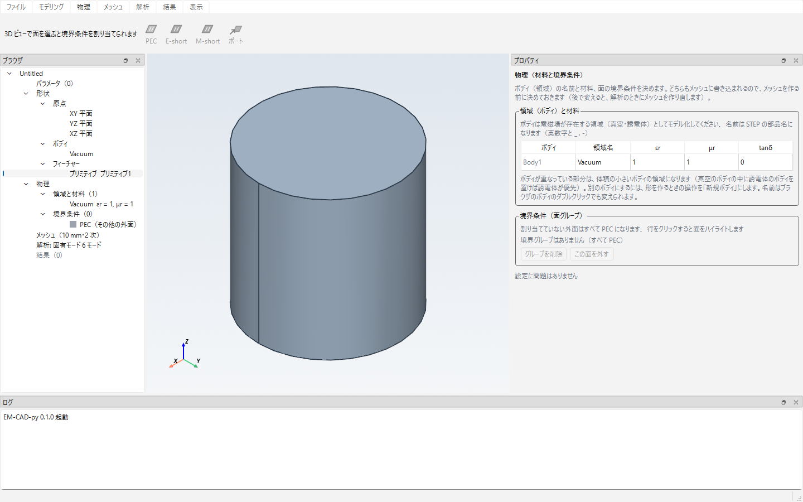

**3. モード数を確かめる** — 「解析」タブ。右の「ソルバー」の **モード数** が `6`（既定）になっています
（低い方から求めるモードの数。多いほど時間がかかります）。

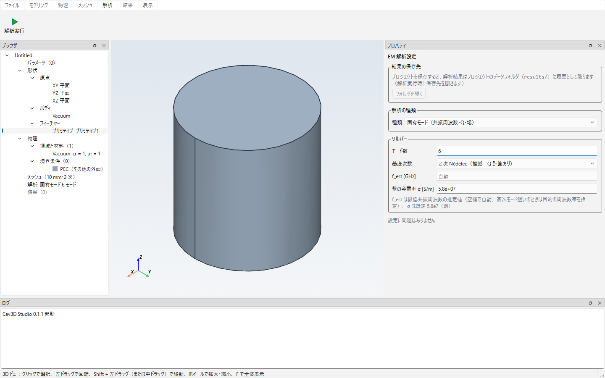

**4. メッシュを作って確かめる** — 「メッシュ」タブ。右の **メッシュサイズ** を `15` にして **メッシュ生成**。
初めてなのでプロジェクトの保存先を聞かれます（例 `Pillbox.cv3dproj`）。数秒で、境界の三角形が 3D ビューに出て、
右に統計（要素 1,290、DOF 9,570、要素品質など）が出ます。状態は「**最新です**」— このメッシュが解析に使われます。

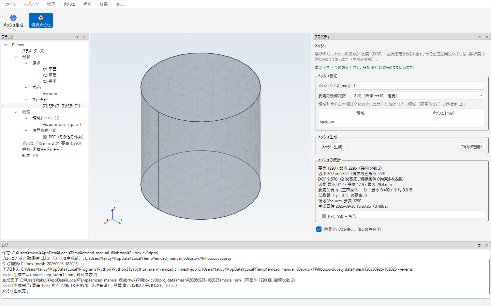

**5. 解析を実行する** — 「解析」タブの **解析実行**。解析の条件の確認が出ます（メッシュタブのメッシュを使うこと、
結果の保存先など）。**実行**。

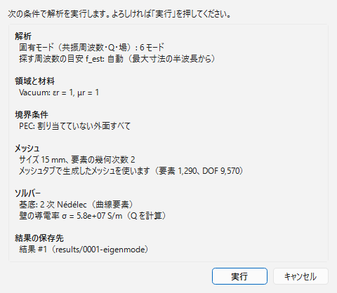

リボンが「結果」タブに切り替わり、右パネルとログに進み具合が出ます（10 秒ほど）。

**6. 結果を見る** — 右のモード表に、# 0: **2.2950 GHz**（TM010。解析解 2.2949 GHz）、# 1・# 2: 2.3097 GHz（TE111。
向きの違う 2 つ）… が並びます。Q は銅の壁（導電率 5.8×10⁷ S/m）での値、P は蓄積エネルギー 1 J あたりの壁損失です。
3D ビューには断面上の電場（ヒートマップと矢印）が出ています。モード表の行をクリックすると、そのモードの表示になります。

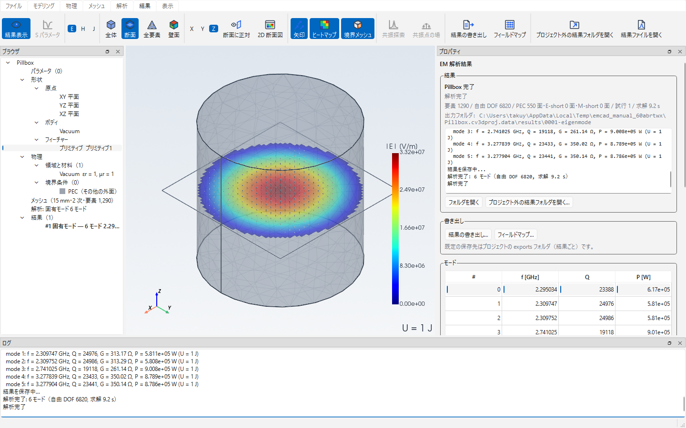

**7. 場を詳しく見る** — リボンの断面の軸 **X**（YZ 面の断面）を押してから **2D 断面図**。別ウィンドウに平面図が出ます。
右上の **色で表す量** を `Ez` にすると、TM010 の Ez が z 方向に一様で、中心軸で最大になっているのが分かります
（3D ビューと右パネルも Ez に変わります）。図の上にマウスを置くと、その点の座標と場の値が下に出ます。

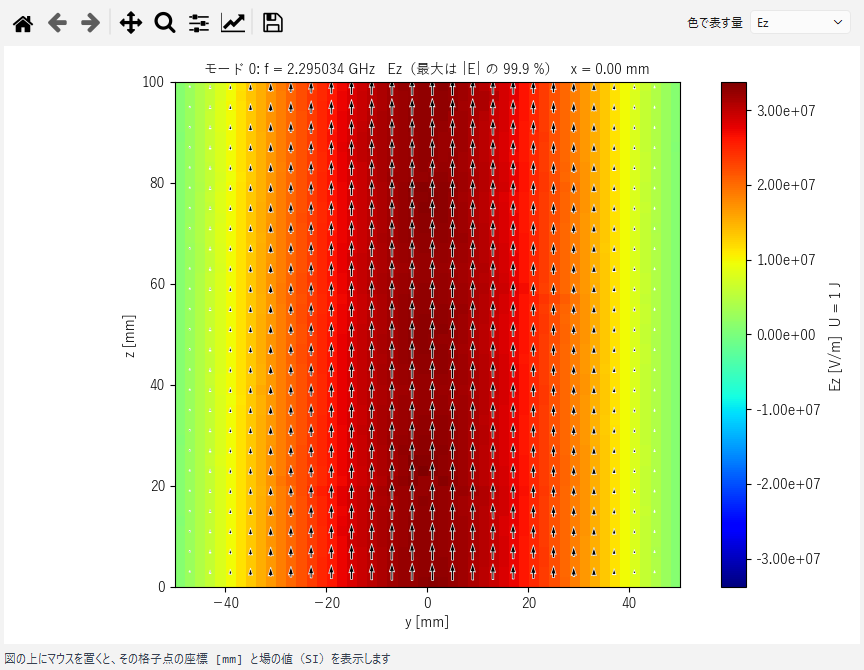

リボンの **全体** にすると、空洞全体の格子点に矢印を描きます。

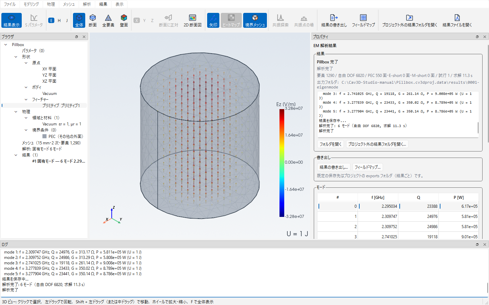

色で表す量を |E| に戻し、リボンの **J** を押すと（表示方法は自動で **壁面** になります）、金属壁（PEC）を流れる
**表面電流** Js の大きさが壁の色で、向きが矢印で出ます。TM010 では、側壁は軸方向に、端板は中心から放射状に流れ、
側壁と端板の縁で強くなります。壁面のまま **E** にすると壁面の電場（壁に垂直。端板の中心で最大）、**H** にすると
壁面の磁場（壁に沿って周方向。大きさは |Js| と同じ）になります。

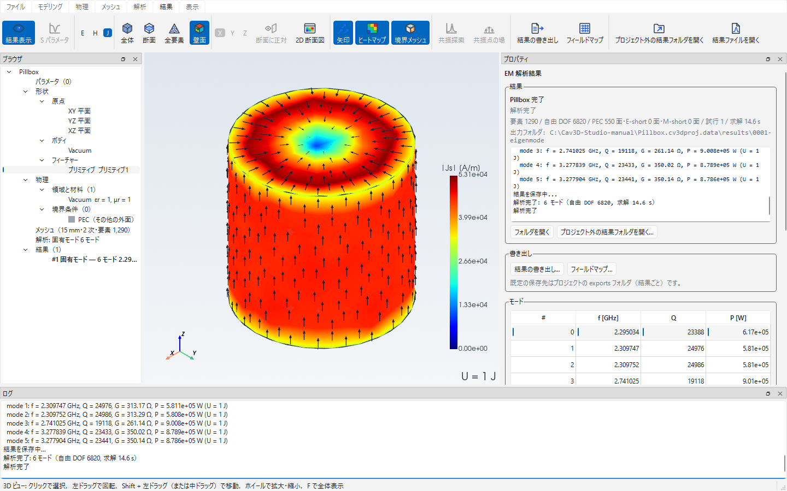

確かめたら **E** と **断面** に戻しておきます（表示の設定は次のプロジェクトにも引き継がれます）。

**8. 書き出す** — **結果の書き出し…** で保存先のフォルダを選ぶと、`frequencies.csv`（周波数・Q など）と各モードの場
`mode_00.vtk` …（ParaView で開けます）ができます。**フィールドマップ…** では、選んでいるモードの E・H を規則格子で
HDF5 / CSV に書き出します（[14 章](#14-書き出しcsv--vtk--touchstone--フィールドマップ)）。

プロジェクトは解析の前に自動で保存されています。ブラウザの「結果」に `#1 固有モード — 6 モード …` が残り、
次に開いたときもクリックで表示できます。

## 5. チュートリアル 2: スケッチと回転でビームパイプ付き空洞を作る

加速空洞によくある、ビームパイプ（半径 20 mm）の付いた円筒空洞（半径 50 mm、長さ 60 mm）を、断面のスケッチを
Z 軸のまわりに回転させて作ります。

**1. 新しいプロジェクト** — 「ファイル」タブの **新規**。

**2. スケッチを始める** — 「モデリング」タブの「スケッチ作成:」で **XZ 平面**。2D のスケッチ画面になります
（横が X = 半径方向、縦が Z = 軸方向。グリッドは 10 mm おき）。

**3. 断面を描く** — **線分**（キー L）で、次の点を順にクリックします。点はグリッドに吸い付きます
（マウスの位置は右のプロパティに X・Y で出ます）。

(0, −60) → (20, −60) → (20, −30) → (50, −30) → (50, 30) → (20, 30) → (20, 60) → (0, 60) → 最初の点 (0, −60)

最初の点をクリックすると閉じて線分ツールが終わり、囲まれた部分が青く塗られます（閉領域。右に「閉領域: 1」）。

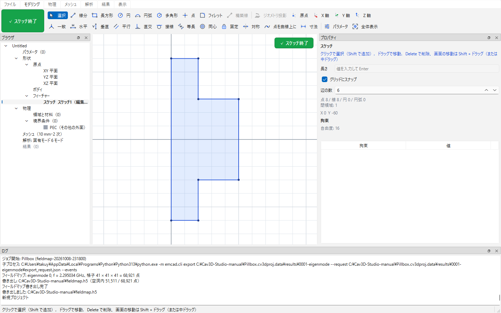

**4. スケッチを終える** — 緑の **✓ スケッチ終了**（リボンの左端、またはスケッチ画面の右上）。

**5. 回転する** — **回転**。スケッチ「スケッチ1」と閉領域が選ばれているので、**回転軸** を `Z 軸` にします
（角度 360 のまま）。プレビューを確かめて **OK**。

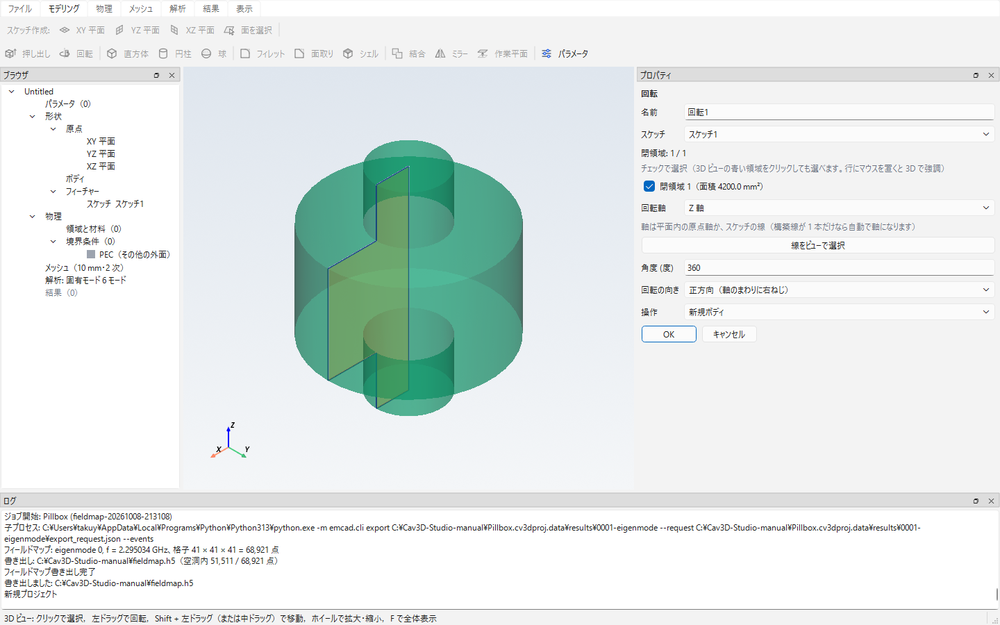

**6. 解析する** — 「物理」タブで領域名 `Vacuum`、「メッシュ」タブでメッシュサイズ `8`、「解析」タブでモード数 `3` にして
**解析実行**
（保存先を聞かれます。例 `BeamPipeCavity.cv3dproj`）。最も低いモードは約 **2.357 GHz** です（ビームパイプの分だけ、
閉じた円筒の 2.2949 GHz より少し高くなります）。結果タブで **断面** と断面の軸 **Y** を押し、表示タブの **正面** に
すると、軸を含む断面（XZ 面）の電場が見えます。

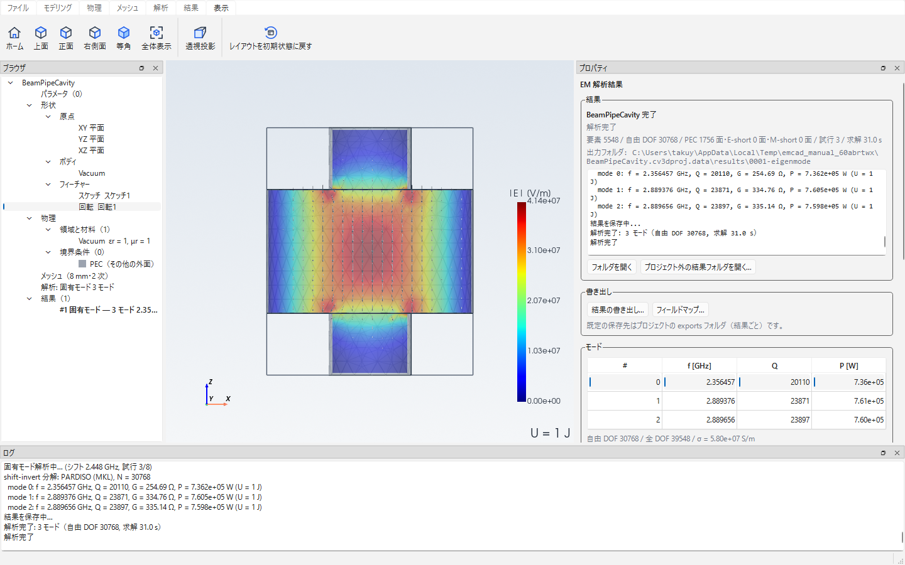

寸法拘束を付けておくと、あとで寸法の値を変えるだけで形を変えられます（[7 章](#拘束と寸法)）。

## 6. チュートリアル 3: 導波管に結合した空洞の S パラメータと共振探索

WR-90 導波管（22.86 × 10.16 mm）から結合窓を通して直方体の空洞に電力を入れる、1 ポートの構造です。
S パラメータを計算し、共振点の周波数 f0 と外部 Qe・内部 Q0 を求めます。

**1. 新しいプロジェクト** — **新規**。

**2. 直方体を 3 つ作る** — 「モデリング」タブの **直方体** を 3 回。直方体の **原点** は角（x・y・z が最小の点）です。
2 つ目からは操作の既定が「結合」なので、3 つが 1 つのボディ `Body1` になります。

| | 大きさ X × Y × Z | 原点 | 操作 |
|---|---|---|---|
| 導波管 | 10 × 22.86 × 10.16 | (0, 0, 0) | 新規ボディ |
| 結合窓 | 10 × 14 × 10.16 | (10, 4.43, 0) | 結合（対象: Body1） |
| 空洞 | 30 × 22.86 × 10.16 | (20, 0, 0) | 結合（対象: Body1） |

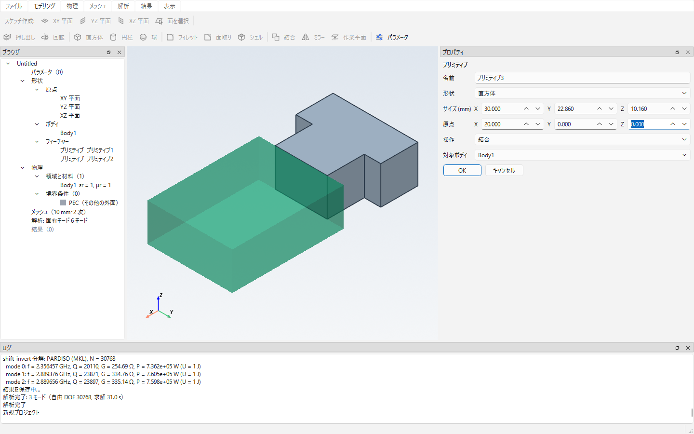

**3. ポートを付ける** — 「物理」タブを開き、3D ビューを回して導波管の端の面（x = 0）をクリックします（選んだ面が
強調され、リボンの境界条件のボタンが押せるようになります）。**ポート** を押すと `PORT1` ができます（ブラウザの
「物理 > 境界条件」と右の一覧に出ます）。右の表で領域名も `Vacuum` にしておきます。

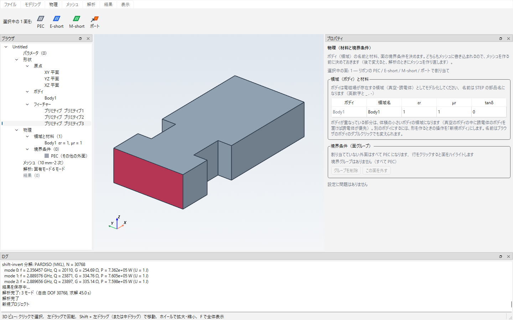

**4. スイープの設定** — 「解析」タブの右の「解析の種類」を **ポートスイープ** にし、開始周波数 `7.4`、終了周波数 `8.4` [GHz]。
**適応スイープ** にチェックを入れると周波数点数が 401 になります（少数の周波数だけを実際に解き、間を補間します）。
**スイープ後に共振探索** にもチェックを入れます。

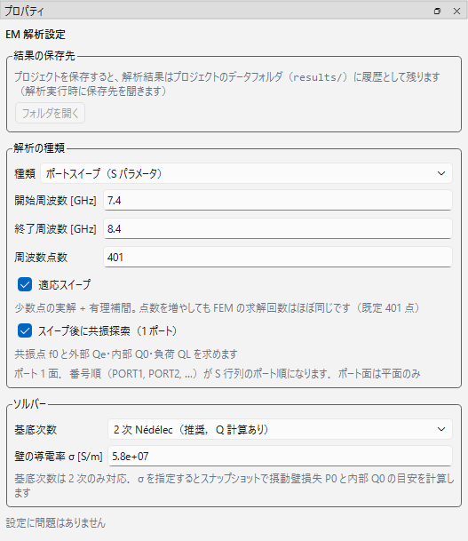

**5. 実行** — 「メッシュ」タブでメッシュサイズ `5` にしてから **解析実行**（保存先を聞かれます）。メッシュ生成・スイープ・
共振探索が続けて行われます（数十秒）。

**6. S パラメータ図** — 終わると **S パラメータ図** が別ウィンドウで開きます。上段 |S11| [dB]、中段 位相、
下段 入力電力あたりの蓄積エネルギー U/P_inc [J/W]。下段の線は S から全周波数点で求めた値で、青い点は実際に FEM で
解いた周波数、黒い点は共振探索で解いた周波数、縦の破線が共振点 f0 です。

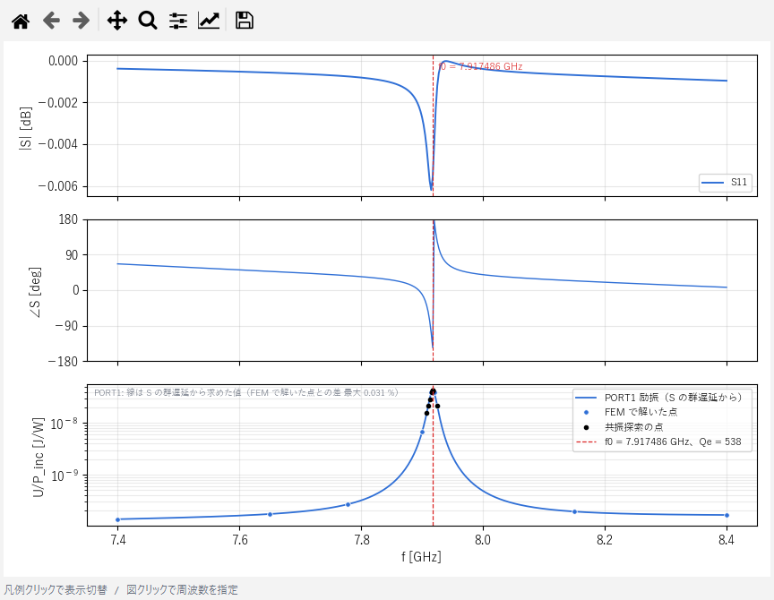

右パネルの「共振探索」に結果が出ます: **f0 ≈ 7.9175 GHz、外部 Qe ≈ 538**（半値幅・S11 位相・複素固有値からの
推定もほぼ同じ）、**内部 Q0 ≈ 7,517**（銅）、負荷 QL ≈ 502、結合係数 β = Q0/Qe ≈ 14。

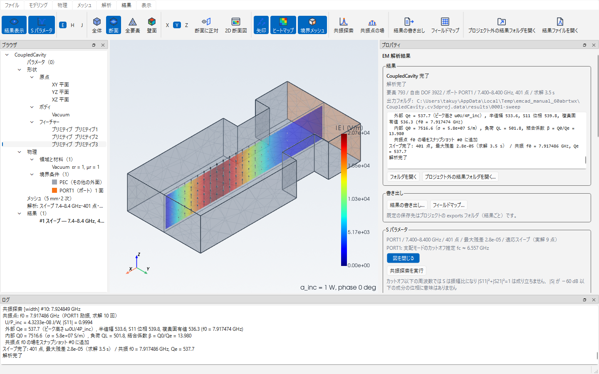

**7. 共振点の場** — リボンの **共振点の場**。f0 で 1 W 入射したときの電場（スナップショット）が表示されます。
**断面** と断面の軸 **Z**、表示タブの **上面** にすると、空洞の中の定在波が見えます。右パネルの「場のスナップショット」の
**時間位相 φ** のスライダで、時間とともに場が変わる様子を見られます。

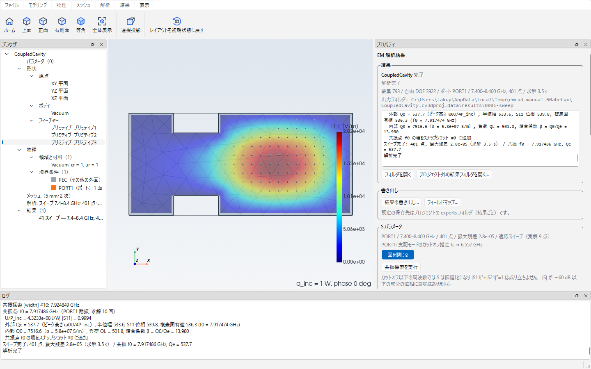

## 7. スケッチ

スケッチは平面上の 2D 図形です。閉じた領域（閉領域）が、押し出し・回転の断面になります。

1. 「モデリング」タブの「スケッチ作成:」で平面を選びます: **XY / YZ / XZ 平面**、作った作業平面、または
   **面を選択** → 3D ビューでボディの平らな面をクリック。
2. スケッチ画面で図形を描き、必要なら拘束・寸法を付けます。
3. 緑の **✓ スケッチ終了** で 3D に戻ります（何も描いていないスケッチは消えます。3D は全体表示になります）。

面の上に作ったスケッチには、その面の輪郭が最初から構築線（緑の破線）として投影されています。スケッチの座標は、
ワールドの原点をその面に射影した点が原点で、上向きの面なら X・Y はワールドと同じです（下の例では 40 × 30 の
上面の中心が (20, 15)）。

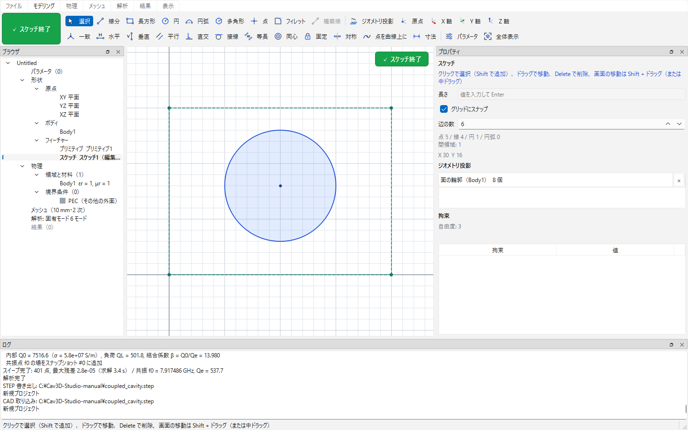

### 描く道具

| 道具 | キー | 使い方 |
|---|---|---|
| 選択 | S | クリックで選択（Shift で追加）、ドラッグで移動（拘束は保たれる）、Delete で削除。拘束の記号や寸法の値をクリックでその拘束を選択、寸法の値をダブルクリックで値を編集 |
| 線分 | L | 始点 → 次の点 … と続けて描く。最初の点をクリックすると閉じて終わり、Enter か右クリックでも終わり。右の「長さ」に数値を入れて Enter で長さを指定 |
| 長方形 | R | 1 つ目の角 → 対角。4 辺に水平 / 垂直の拘束が付く |
| 円 | C | 中心 → 円周上の点（半径は数値でも） |
| 円弧 | A | 中心 → 始点 → 終点（始点から反時計回り） |
| 多角形 | P | 中心 → 頂点。辺の数は右のパネル |
| 点 | | 置く位置をクリック |
| フィレット | | 2 本の線が接する角（点）か、線を 2 本クリック。半径は右の「フィレット半径」か数値入力。線を短くして接する円弧を入れる。半径が線の端に届くと（例: 20 × 10 の長方形に r = 10）その線は消え、円弧が隣の線に直接つながる |
| 構築線 | | 選んだ線・円・円弧を構築線（補助線）⇄ 通常 に切り替える。構築線は閉領域の境界にならない |

- **スナップ**: 既存の点 → 線の中点 → 水平 / 垂直の揃え → グリッド の順に吸い付きます。グリッドの間隔は拡大率に応じて
  1・2・5 の系列で変わります。右の「グリッドにスナップ」で切れます。
- マウスの位置は右のプロパティに出ます。中ドラッグで平行移動、ホイールで拡大・縮小（カーソルの位置を中心）、
  F で全体表示、Esc で道具のキャンセル。
- **閉領域は、線の交差で分けられた最小の領域**として見つけます（重ねた長方形は 3 つの領域、はみ出した線は領域を分ける）。
  押し出し・回転では、使う閉領域をチェックリストか 3D ビューのクリックで選べます。

### 拘束と寸法

リボンの拘束のボタンを押してから、対象をクリックします。矛盾する拘束は付けられません（メッセージが出ます）。
右のプロパティの「拘束」に一覧と自由度が出ます（× で削除、寸法は値を直接編集）。

| 拘束 | 対象 | 記号 |
|---|---|---|
| 寸法 | 円・円弧 → 半径、点 2 つ → 距離、線 → Enter で長さ、点と線 → 点と直線の距離、平行な線 2 本 → 間の距離、平行でない線 2 本 → 角度。値は式でもよい（例 `W/2`） | 寸法線と値 |
| 一致 | 点 2 つ（1 点にまとめる）。点 → 線・円・円弧 なら「点を曲線上に」 | • |
| 点を曲線上に | 点、次に線・円・円弧 | ◦ |
| 水平 / 垂直 | 線 | H / V |
| 平行 / 直交 | 線 2 本 | ∥ / ⊥ |
| 接線 | 線と円・円弧、または円・円弧どうし（端点を共有していてもよい） | T |
| 等長 / 等半径 | 線 2 本、または円・円弧 2 つ | = |
| 同心 | 円・円弧 2 つ | ◎ |
| 固定 | 点 | ⚓ |
| 対称 | 点 2 つと対称軸の線 | S |

寸法の値を変えると図形が動きます。動いてほしくない点は **固定** するか、原点・軸に拘束しておきます
（例: 回転体の断面で、軸上の辺が軸から離れないように）。

**点と線・平行な 2 本の線の寸法** は、点から直線（線を延ばした直線）までの垂直な距離です。平行な 2 本の線では、
1 本目の線の始点と 2 本目の直線との距離になります（2 本が平行であることまでは保ちません。長方形の辺のように水平・垂直・
平行の拘束が付いていれば、平行のまま動きます）。線の端点と、その線自身には付きません。

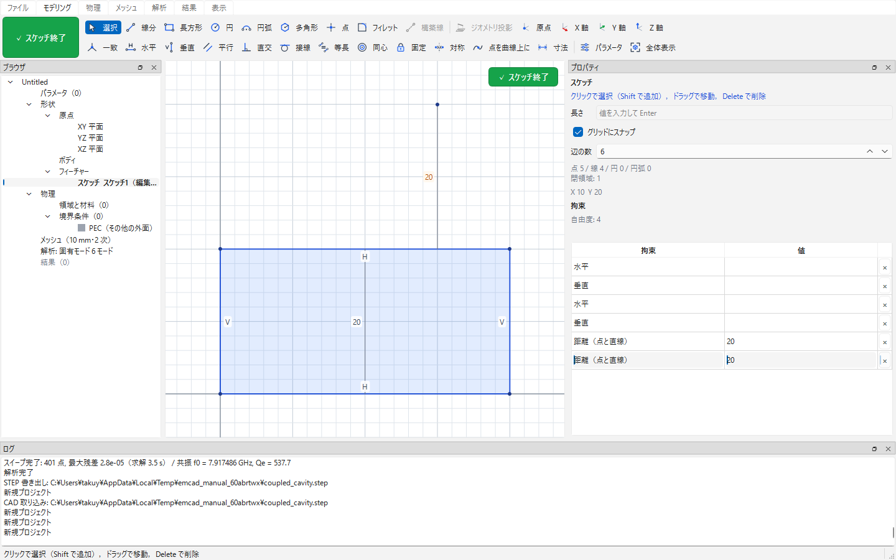

### ジオメトリ投影

ボディのエッジや面、原点・座標軸をスケッチ平面に投影して、描く図形の基準にできます（モデルを変えると追従します。
投影した点は動きません）。**ジオメトリ投影** を押して 3D ビューでエッジか面（輪郭のエッジ全部）をクリック。
**原点 / X 軸 / Y 軸 / Z 軸** で原点の点・軸の構築線を追加します。右の「ジオメトリ投影」の一覧で選択・削除できます。

### パラメータ

**パラメータ** で名前付きの値（例 `R = 50`、`L = 2*R + 5`）を定義すると、寸法・押し出しの距離・回転の角度などの式で
使えます。値を変えると、そのパラメータを使うスケッチがすべて解き直され、立体が作り直されます。

## 8. 3D モデル

フィーチャーは作った順に計算され、途中のフィーチャーを直すと、それより後ろが作り直されます。フィレットのエッジや
面の上のスケッチなどの参照は、形の特徴（種類・重心・法線・大きさ）で覚えているので、寸法を変えても追従します。

| フィーチャー | 内容 |
|---|---|
| 押し出し | スケッチと閉領域（チェックリストか 3D ビューのクリック）、距離（式でも）、方向（法線 / 反転 / 対称）、操作（新規ボディ / 結合 / 切り取り / 交差）と対象のボディ。緑の半透明がプレビュー |
| 回転 | 軸は平面内の座標軸か、スケッチの線（「線をビューで選択」。構築線が 1 本だけならそれが軸）。軸は閉領域の外側か境界に置く（閉領域をまたげない）。**回転の向き**: 正方向（軸の向きに右ねじ）/ 逆方向 / 両側に半分ずつ（対称）。角度が 360° 未満のときに違いが出る |
| 直方体 / 円柱 / 球 | 大きさと原点。直方体の原点は角（x・y・z が最小の点）、円柱は底面の中心から +Z 方向、球は中心。操作は押し出しと同じ |
| フィレット / 面取り | 3D ビューでエッジをクリック（もう一度で外す）。「ループ選択」か Ctrl + クリックで、つながった閉じたループをまとめて選ぶ。**半径は隣の面の幅まで**（面を使い切る半径: 円柱の上の縁に高さと同じ r、上下から 5 + 5 など）作れる。幅を超えると幅を添えたエラー |
| シェル | 開口にする面を選んで肉厚を指定 |
| 結合 | 対象のボディと道具のボディを選び、結合 / 切り取り / 交差（道具を残すこともできる） |
| ミラー | **ボディ全体** か **フィーチャー**（このミラーより前の押し出し・回転・直方体・円柱・球をチェックで選ぶ）を、**対称面** で鏡映する。対称面は原点平面（XY / YZ / XZ）、作業平面、**面（3D ビューで選択）**（ボディの平らな面をクリック）。フィーチャーのミラーは元と同じ操作（結合・切り取り）で同じボディに加わる（元が「新規ボディ」ならそのボディに結合）。ボディ全体のミラーは、操作「結合」で元のボディと 1 つに、「新規ボディ」で別のボディに。緑の半透明が鏡映した形のプレビュー |
| 作業平面 | 原点平面・作業平面・面から、距離を離した平面（スケッチ用） |
| 取り込み | STEP / IGES / BREP（[9 章](#取り込みと書き出し)） |

押し出しの方向 **法線** はスケッチ面の表側（面の上のスケッチでは面の外向き）です。**面の上のスケッチで操作を
「切り取り」にすると、方向は自動で「反転」（面の内側へ）になります**（穴をあける向き。あとから変えることもできます）。

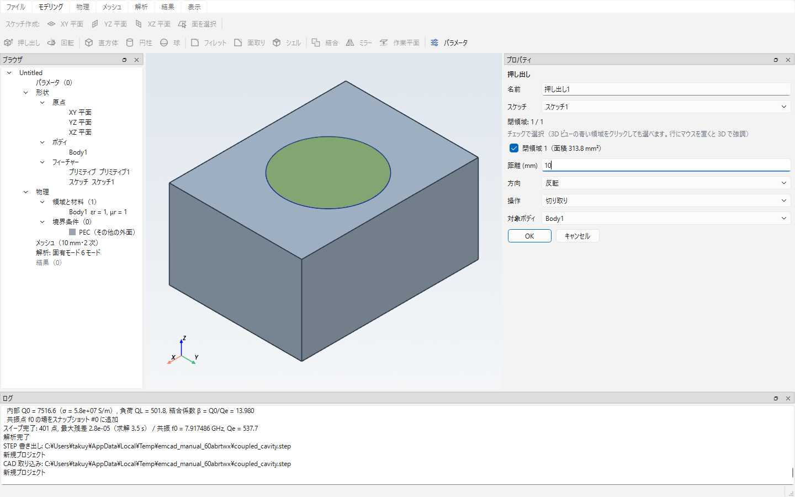

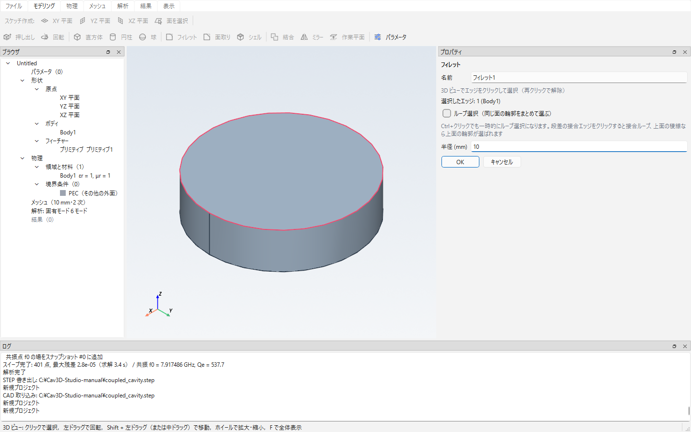

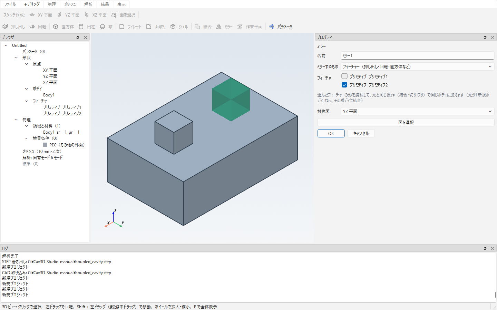

- フィーチャーの編集・抑制・削除: ブラウザでフィーチャーをクリック → 右の **編集 / 抑制 / 削除**（ダブルクリックでも編集）。
- 計算に失敗したフィーチャーは飛ばして続け、理由を右パネルとログに出します（ブラウザでは赤字と ⚠）。
- 面・エッジ・ボディをクリックすると、右に面積・長さ・体積などが出ます。
- **ボディを分ける**: 押し出し・回転・直方体などの操作を **新規ボディ** にすると別のボディになります（最初の立体は
  新規ボディ、2 つ目からの既定は **結合**）。誘電体など材料の違う部分は別のボディにします（[10 章](#ボディと領域名)）。

## 9. プロジェクトとファイル

### プロジェクト（`*.cv3dproj`）

モデル（スケッチ・フィーチャー・パラメータ）、解析の設定、取り込んだ CAD、**解析結果の履歴** を 1 つのプロジェクトで
管理します。ファイル 1 つと、同じ名前のデータフォルダの組です:

```
Buncher.cv3dproj          ← これを開く（モデルと設定）
Buncher.cv3dproj.data\    ← データフォルダ（プロジェクトを移すときはフォルダごと）
    cad\                  取り込んだ CAD ファイルのコピー
    mesh\<日時>\          メッシュタブで作ったメッシュ（いまのもの 1 つ）
    results\0001-eigenmode\   解析 1 回分（メッシュ・結果・ログ …）
    results\0002-sweep\
    exports\              書き出しの既定の保存先
```

- 「ファイル」タブ: **新規 / 開く… / 最近使ったファイル / 保存 / 名前を付けて保存…**。保存していない変更があると、
  ウィンドウのタイトルに `*` が付き、閉じる・新規・開くときに保存するか聞かれます。
- **解析実行とメッシュ生成の前に、プロジェクトは自動で保存されます。** まだ保存したことがなければ、そのとき保存先を
  聞かれます。
- 解析の結果は `results\` に番号付きで **すべて残ります**（メッシュサイズを変えた比較なども 1 つのプロジェクトで）。
  ブラウザの「結果」に `#2 スイープ — 7.4–8.4 GHz, 401 点 …` のように並び、クリックで表示が切り替わります
  （表示中は太字。解析の実行中は切り替えられません）。
- モデルを変えたあとの古い結果には **（形状変更前）**（3D の場は隠れる。「結果表示」で重ねることはできる）か
  **（設定変更前）** が付きます。
- 結果を右クリック: **名前を変更**（例「メッシュ 5 mm」）、**フォルダを開く**、**削除**（元に戻せません）。
- プロジェクトを開くと、最後に表示していた結果が表示されます。
- **名前を付けて保存** は、データフォルダ（CAD・メッシュ・結果）ごと複製します。

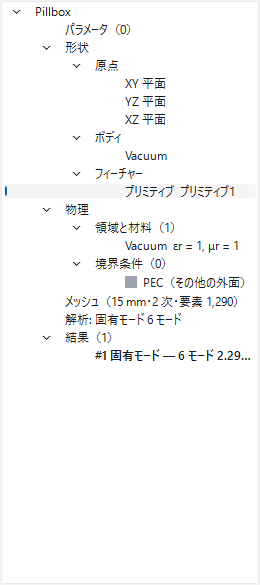

### 取り込みと書き出し

- **CAD 取り込み**（「ファイル」タブ）: 他の CAD で作った **STEP（.step / .stp）・IGES（.iges / .igs）・BREP（.brep）** を
  取り込みます。ソリッドごとにボディができ、STEP の部品名が領域名になります（英数字に直し、重なれば `_2` …。
  IGES・BREP は名前が無いので、物理タブの領域の表かブラウザで付けます）。単位は mm に換算します（BREP は mm と
  みなします）。IGES が面だけのときは面を縫い合わせて立体にします。**取り込んだファイルはプロジェクトの `cad\` にコピー** されます。
  取り込んだボディにも、フィレット・面の上のスケッチ・結合・境界条件がそのまま使えます。

  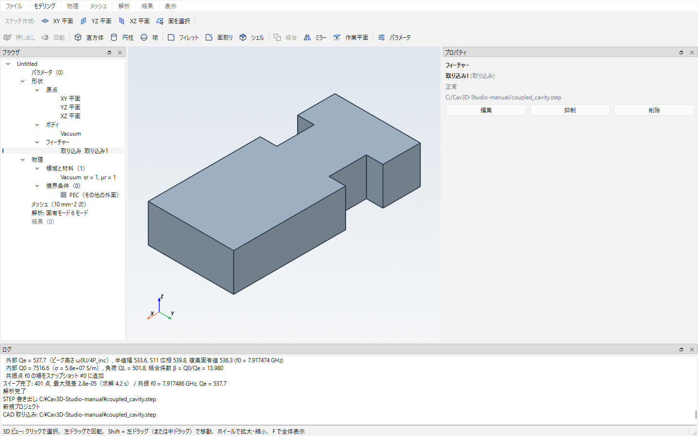

- **モデル書き出し（.emcad.json）**: モデルと解析の設定を JSON で書き出します
  （結果は含みません）。「開く」で .emcad.json を開くと、保存していない新しいプロジェクトになります。
- **STEP 書き出し / job.json 書き出し**: ボディを領域名付きの STEP に、解析の設定を `job.json` に書き出します。
  コマンドラインの `Cav3D-Studio.exe solve` で同じ解析ができます（[付録 C](#c-コマンドライン)）。

## 10. 物理（材料と境界条件）

「物理」タブで、ボディ（領域）の名前と材料、面の境界条件を決めます。右パネル（物理パネル）に領域の表と境界条件の一覧、
リボンに境界条件のボタンがあります。どちらもメッシュに書き込まれるので、**メッシュを作る前に** 決めておきます
（後から変えると、解析実行のときにメッシュが作り直されます）。

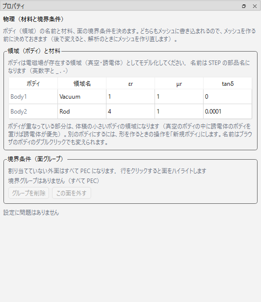

### モデルの考え方

- ボディは **電磁場が存在する領域**（真空・誘電体）です。金属はモデル化しません（ボディの外側が金属）。
- 材料（εr・μr）の違う部分（誘電体など）は、**別のボディ** にします。
- 割り当てていない外面はすべて **PEC**（完全導体。壁の損失 Q の計算に使う）。対称面で半分に切ったモデルでは、切り口に
  **E-short**（電気壁: 電場が面に垂直）か **M-short**（磁気壁: 磁場が面に垂直）を付けます。導波管の口には **ポート**。
- **同軸のポート**: 同軸線路は、内導体の部分をくり抜いた筒のボディ（断面が円環）で作り、端の **円環の面** をポートに
  します。内導体と外導体があるポートは自動で TEM（同軸）モードになります（遮断周波数なし）。同軸を半分に切るときは、
  軸を含む切り口を **M-short** にします。

### ボディと領域名

- **別のボディを作る**: 立体を作るフィーチャー（押し出し・回転・直方体・円柱・球・ミラー）の **操作** を **新規ボディ**
  にします。最初の立体は新規ボディですが、2 つ目からは既定が **結合**（前のボディとくっついて 1 つになる）なので、
  誘電体などは「新規ボディ」に切り替えてください。ブラウザの「形状 > ボディ」にボディが並びます。
- **ボディが重なった部分** は、**体積の小さいボディ** の領域になります。真空の大きなボディの中に誘電体のボディを重ねて
  置けば、重なった部分は誘電体になります（真空のボディから誘電体の形をくり抜いておく必要はありません）。
- **名前（領域名）**: ボディの名前がそのまま解析の領域名です（既定は `Body1`, `Body2`, …。STEP の取り込みでは部品名）。
  物理パネルの表の「領域名」をダブルクリックするか、ブラウザのボディ（か「物理 > 領域と材料」の項目）を
  **ダブルクリック / 右クリック → ボディの名前を変更** で変えます。名前は英数字と `_ . -` で、ほかのボディと重ならないこと。

例（上の図）: 円柱 半径 20・高さ 40（新規ボディ → 名前 `Vacuum`）と、同じ中心の円柱 半径 5・高さ 40（操作を「新規ボディ」
に → 名前 `Rod`、εr = 4、tanδ = 1e-4）。メッシュでは棒の部分が `Rod`、そのまわりが `Vacuum` になります（メッシュタブの統計に
「領域 Rod: 要素 …」「領域 Vacuum: 要素 …」と出ます）。

### 領域と材料

「領域（ボディ）と材料」の表で、ボディごとに領域名・εr・μr・tanδ を入れます（Enter か別の欄へ移ると確定）。
領域ごとのメッシュサイズはメッシュタブで指定します。

| 列 | 意味 |
|---|---|
| εr / μr | 比誘電率 / 比透磁率（真空は 1） |
| tanδ | 誘電正接（誘電体損失）。0（既定）は損失なし。与えると、モードの **Q は壁損失と誘電体損失の合計**（1/Q = 1/Q_wall + 1/Q_diel）になり、共振探索の内部 Q0 にも入ります |

誘電体損失は、損失なしで解いた場から見積もります（摂動。固有値の計算時間は変わりません）。tanδ が小さい
（目安 0.05 以下）ときに正確で、それより大きいと注意が出ます。全体を一様に満たした誘電体では Q_diel = 1/tanδ です。
S パラメータ（ポートスイープ）は、壁と同じく損失なしで解きます（誘電体損失は Q0 だけに入ります）。

### 境界条件

3D ビューで面をクリックし（Shift で追加）、リボンの **PEC / E-short / M-short / ポート** を押します。
PEC・E-short・M-short は種類ごとに 1 つのグループ、ポートは押すたびに `PORT1`, `PORT2`, … ができます
（番号の順が S 行列のポートの順）。面は 1 つのグループにしか入りません。右の「境界条件（面グループ）」の行
（またはブラウザの「物理 > 境界条件」）をクリックすると面が強調され、**グループを削除** / **この面を外す** で直せます。
形を変えて面が見つからなくなると ⚠ が付きます（選び直してください）。

境界条件は、選んだ面の **全体** に付きます。ボディが重なっていて面が分かれる場合（真空の円柱の上面を選び、中の棒の上面も
同じ平面にある、など）も、分かれた部分すべてに付きます。分かれた部分が別の境界条件の面にも含まれるときは、面積の小さい方の
面の境界条件になります。別のボディの中に入って領域の界面になった部分には付きません。

## 11. メッシュ

「メッシュ」タブで、解析に使う四面体メッシュの細かさを決め、解析の前に **メッシュだけを作って確かめ** られます。

| 設定（右パネル） | 意味 |
|---|---|
| メッシュサイズ [mm] | 要素の大きさの目安。小さいほど正確で、計算時間とメモリが増えます |
| 要素の幾何次数 | 2 次（曲線の四面体。曲面を正確に表すので推奨）/ 1 次 |
| 領域別サイズ [mm] | 領域ごとのメッシュサイズ。空欄は全体の値。誘電体など、細かくしたい領域だけ指定します |

- **メッシュ生成**（リボンまたは右パネル）: プロジェクトを保存してから、別のプロセスでメッシュを作ります。
  途中でやめるときは **中止**。
- できると、3D ビューに **境界メッシュ**（境界の三角形。境界条件の色: PEC 灰、E-short 青、M-short 緑、ポート 橙）が出て
  （ボディは半透明）、右に **統計** が出ます:
  - 要素・節点・辺・面・境界の三角形の数
  - **DOF**（自由度の数）— 計算時間とメモリの目安（例: 約 17 万 DOF の固有モード計算が、pypardiso ありで十数秒）
  - 辺の長さ（最小・平均・最大）、**要素品質 η**（正四面体 = 1。0.1 未満の悪い要素の数も）、領域ごとの要素数
  - 境界条件ごとの三角形の数
- 状態: **最新です**（いまの設定と同じ。解析でそのまま使われる）/ **要再生成**（メッシュの設定・領域名・境界条件が
  変わった）/ **形状が変わった**。材料（εr・μr）・ソルバー・解析の種類を変えても最新のままです。
- 最新のメッシュは、解析実行のときにそのまま使われます（ログに「メッシュを再利用」）。最新でなければ、解析実行の
  ときに作り直されます。
- **境界メッシュ** のボタンで表示 / 非表示。形を変えると隠れます。
- メッシュはプロジェクトの `mesh\<日時>\` に置かれます（**フォルダを開く**。`model.msh` は gmsh で開けます）。
  作り直すと新しいフォルダに作り、できたら古いものを消します。失敗・中止のときは直前のメッシュのままです。

## 12. 解析の設定と実行

「解析」タブで、解析の種類とソルバーを決め（右パネル）、**解析実行** で実行します。領域・材料・境界条件は「物理」タブ
（[10 章](#10-物理材料と境界条件)）、メッシュの細かさは「メッシュ」タブ（[11 章](#11-メッシュ)）で決めます。

### 解析の種類とソルバー

| 設定 | 意味 |
|---|---|
| 解析の種類 | **固有モード**（共振周波数・Q・場）/ **ポートスイープ**（S パラメータ。ポートが要る） |
| 開始 / 終了周波数 [GHz]・周波数点数 | ポートスイープの範囲。点数の既定は 41（適応スイープでは 401） |
| 適応スイープ | 少数の周波数だけを実際に解き、間を有理関数で補間します。点数を増やしても FEM で解く回数はほとんど増えません |
| スイープ後に共振探索（1 ポート） | U/P_inc が最大の周波数 f0 を探して、Qe・Q0・QL を求めます |
| モード数 | 固有モードで求めるモードの数 |
| 基底次数 | 2 次 Nédélec（推奨。Q も計算）/ 1 次 Whitney（速いが粗い。確認用。誘電体は不可） |
| f_est [GHz] | 探し始める周波数の目安。空欄なら自動（最大寸法の半波長から。足りなければ 1.4 倍ずつ上げて探し直す） |
| 壁の導電率 σ [S/m] | 既定 5.8×10⁷（銅）。空欄にすると Q を計算しません |

設定に問題（名前の重複、ポートの無いスイープなど）があると、パネルの下に出て、解析実行できません。

### 実行・キャンセル・強制停止

**解析実行** を押すと、まず **解析の条件の確認** が出ます（解析の種類、領域と材料、境界条件、メッシュ（メッシュタブのものを
使うか）、ソルバー、結果の保存先、注意）。**実行** でプロジェクトが保存され、別のプロセスで メッシュ生成 → 行列の組み立て →
求解 → 保存 と進みます。リボンは「結果」タブに切り替わり、進み具合が右パネルとログに出ます。

- **キャンセル**: 次の段階か、次の周波数点で止まります（1 回の求解の途中では止まりません）。
- **強制停止**（解析タブのリボンと結果パネル）: 確かめたうえで、計算のプロセスをすぐに終わらせます（メッシュ生成中の
  gmsh も一緒に終わります）。その結果は「キャンセル」として履歴に残るので、要らなければ削除してください。

結果のフォルダ（`<名前>.cv3dproj.data\results\<番号-種類>\`）の中身は [付録 D](#d-結果フォルダの中身) にあります。

## 13. 結果を見る

「結果」タブ（右パネル = 結果パネル）で、表示中の結果を見ます。以前の結果はブラウザの「結果」から開きます
（計算し直しません）。

### 固有モード

- **モード表**: #、f [GHz]、Q、P [W]。各モードは **蓄積エネルギー U = 1 J** に規格化されていて、表示される
  E [V/m]・H [A/m] は 1 J を蓄えたときの場の強さ、P はそのときの損失（壁損失 + 誘電体損失。Q = ωU/P）です。Q・P は
  導電率か tanδ を指定したときだけ。tanδ のある領域があれば、行のツールチップに Q の内訳（壁 Q_wall・誘電体 Q_diel）が出ます。
- 行にマウスを乗せると、G [Ω]（幾何因子）・残差（正常なら 1e-10 程度以下）・η（ニセのモードの目安。本物のモードは ≈ 1）が
  出ます。残差か η がおかしいモードは # に **⚠** が付きます。
- 行をクリックすると、そのモードを表示します。

### 場の表示

よく使うものはリボンの「結果」タブに、細かい設定は右パネルの「表示」にあります。

| 設定 | 意味 |
|---|---|
| 結果表示 | 解析結果（場と境界メッシュ）を 3D ビューに重ねる / 隠す |
| E / H / J | 表示する場。H は E から求めた磁場（E と時間の位相が 90° ずれた振幅分布）。J は壁面の表面電流 Js = n × H で、選ぶと表示方法は壁面になる（壁面以外にすると H に戻る） |
| 全体 / 断面 / 全要素 / 壁面 | 全体 = 空洞全体の格子点の矢印、断面 = 断面上の矢印とヒートマップ、全要素 = 要素の重心の矢印、壁面 = 金属壁（PEC）の色と矢印（E: 壁面の電場、H: 壁面の磁場、J: 表面電流） |
| X / Y / Z・位置 | 断面の向きと位置（位置は右パネルのスライダ）。**断面に正対** で断面を正面から見る |
| 色で表す量 | ヒートマップと矢印の色を、大きさ **\|E\|**（0 〜 最大）か、1 成分 **Ex / Ey / Ez**（符号付き。0 が色の中央）にする |
| 格子数 N | 格子は全軸で同じ間隔。最も長い辺を N 分割した間隔をほかの辺にも使う（実際の間隔と点数は N の下に出る）。断面は面内の長い方の辺。壁面では矢印の間隔（最も長い辺 / N） |
| 矢印の長さ・不透明度 | 矢印の倍率、ボディの不透明度 |
| 矢印 / ヒートマップ / 境界メッシュ | それぞれの表示のオン・オフ。境界メッシュは解析に使った境界の三角形（境界条件の色） |

- **壁面**: 金属壁（PEC 面。境界条件を割り当てていない外面と PEC のグループ）だけに色を塗ります。J を選ぶと表面電流
  Js = n × H [A/m]（n は壁の外向きの法線。壁損失の密度は (Rs/2)|Js|²）、H を選ぶと壁面の磁場 [A/m]（金属の表面では
  壁に沿う。大きさは |Js| と同じで、向きは Js と直交）、E を選ぶと壁面の電場 [V/m]（金属の表面では壁に垂直。放電・
  耐電圧の目安）。色は三角形の頂点の値を補間したもので、矢印は三角形の重心の値を、空間を一辺「最も長い辺 / N」の
  立方体に区切って 1 区画 1 本に間引いて描きます（細かいメッシュでも矢印の密度がそろう）。表面電流と磁場の矢印は壁に
  沿って、電場の矢印は壁の外側に描きます。スナップショットでは時間位相 φ の
  瞬時値です。ヒートマップのボタン（右パネルの「壁面の色を表示」）で色を消すと、矢印だけが色付きで出ます
- 色は jet（青 → 赤）です。3D ビューの右に目盛り付きのカラーバー、その下に規格化（`U = 1 J`、スナップショットは
  `a_inc = 1 W` と位相）が出ます。
- 成分を選ぶと、その成分の最大が |E| の最大の何 % かが右パネルと 2D 断面図に出ます（数 % 以下なら、ほぼ数値誤差の成分です）。
- **2D 断面図**: 3D の断面と同じ場を別ウィンドウに平面図で描きます（ヒートマップ・面内の矢印・カラーバー）。図の上に
  マウスを置くと、その格子点の座標と場の値が出ます。場・軸・位置・モード・色で表す量は 3D と連動します。場が断面に
  ほぼ垂直なとき（面内の成分が 2 % 未満）は矢印を描きません。上のツールバーで拡大・移動・画像の保存ができます。
- 形を変えると、結果は「形状変更前」になって 3D の表示が消えます（元に戻せば戻ります）。

### ポートスイープ

- **S パラメータ図**（別ウィンドウ。リボンの **S パラメータ** で開く / 閉じる）: 上段 |S| [dB]、中段 位相、
  下段 入力電力あたりの蓄積エネルギー U/P_inc [J/W]。凡例のクリックで線の表示を切り替え、図の上にマウスを置くと値、
  クリックでその周波数がスナップショットの欄に入ります。
- 適応スイープの U/P_inc は、実際に解いた周波数だけでなく、**S の周波数変化（群遅延）から全周波数点で求めた線** に
  なります。解いた点（印）とのずれを図の左上に出します（5 % を超えたら S からの線は使わず、解いた点をつなぎます）。
  共振の幅に比べて周波数の刻みが粗いと、共振付近のずれが数 % になります — 点数を増やしても FEM の求解回数は
  ほとんど増えないので、細かくするのが効きます。
- 右パネルには各ポートの基本モードの遮断周波数の目安が出ます。遮断周波数より低い帯域では S は振幅比で、
  |S11|² + |S21|² = 1 は成り立ちません。
- **同軸ポート**（円環の面のポート）には遮断周波数の代わりに **特性インピーダンス Z0** が出ます（ログにも）。
  同軸ポートの S は、そのままではその線路の Z0 を基準にした値です（一様な線路なら Z0 によらず S11 = 0）。
  測定器や回路シミュレータ（50 Ω 系）と比べるときは、右パネルの **同軸ポートの S を基準インピーダンスに換算** を
  オンにして値（既定 50 Ω）を入れると、S パラメータ図と書き出し（CSV・Touchstone）がその基準の S になります
  （線路の Z0 と基準の違いの分が反射として S11 に出ます。例: 75 Ω の線路を 50 Ω 基準で見ると最大 −8.3 dB）。
  導波管ポート、共振探索の f0・Q、U/P_inc の曲線は換算の影響を受けません。この設定は次回の起動にも引き継がれます。
  M-short で半分に切った同軸では、切った断面の値（全体の 2 倍）が出ます。
  基本モードの TEM だけを吸収するので、TE11 などの高次モードが伝搬する周波数（外導体と内導体の半径の和を
  a + b [mm] として、おおよそ 95.5/(a + b) GHz より上。誘電体を詰めた同軸では √εr で割る）では、ポートを不連続部から十分離してください。
- **場のスナップショット**: 周波数と励振ポートを指定して **スナップショットを計算** すると、その周波数の場を 1 点だけ解いて
  表示します（1 W 入射に規格化）。一覧から選び、**時間位相 φ** のスライダで時間変化を見られます。

### 共振探索（1 ポート）

スイープの U/P_inc が最大になる周波数 f0 を探して精密に求め、次を計算します:

| 値 | 意味 |
|---|---|
| f0 | 共振周波数 |
| 外部 Qe | ポートから出ていく電力で決まる Q（ω0U/(4P_inc) から。半値幅・S11 の位相・複素固有値からの推定も並べて表示） |
| 内部 Q0 | 壁の損失と誘電体損失（tanδ）で決まる Q（導電率か tanδ を指定したとき）。tanδ があれば内訳（Q_wall・Q_diel）も出る |
| 負荷 QL | 1/QL = 1/Q0 + 1/Qe |
| β | 結合係数 Q0/Qe（1 より大きければ過結合） |

- 共振点の場はスナップショットに加わり、**共振点の場** で表示できます。S パラメータ図に f0 の縦線が入ります。
- 条件: ポートが 1 つ、共振がスイープの範囲の内側、ポートの導波管が伝搬する周波数。
- 共振探索を付けずに解いたスイープにも、**あとから実行** できます（リボンの **共振探索**、または結果パネルの
  **共振探索を実行**）。スイープは解き直さず、その結果に追記します。

### プロジェクトの外の結果

- **プロジェクト外の結果フォルダを開く…**: コマンドラインで解いた結果のフォルダなども表示できます。
- **結果ファイルを開く…**: 結果の HDF5 ファイル（`*_result.h5` / `*_sweep.h5`）を **表示だけ** の形で開きます。場の表示・
  2D 断面図・書き出し・フィールドマップが使えます（スナップショットの追加計算と共振探索はできません）。

## 14. 書き出し（CSV / VTK / Touchstone / フィールドマップ）

表示中の結果を、他のソフト（ParaView、回路シミュレータ、ビーム計算など）で使える形で書き出します。リボンの「結果」タブ、
または結果パネルの「書き出し」から。別のプロセスで動き、進み具合の画面の **中止** で止められます。終わると書き出した
場所が出ます（**フォルダを開く**）。既定の保存先はプロジェクトの `exports\<結果>\` です。

**結果の書き出し…**（保存先のフォルダを選ぶ）

| 結果 | 書き出すファイル |
|---|---|
| 固有モード | `frequencies.csv`（モード番号・周波数・k²・残差・η。導電率があれば Q・G・表面抵抗 Rs・U・P・σ。tanδ があれば Q_wall・Q_diel・P_diel も）、`mode_00.vtk` …（各モードの E と H。ParaView で開ける） |
| ポートスイープ | `s_params.csv`（各 S の実部・虚部・dB、残差、蓄積エネルギー）、`s_params.s1p` などの **Touchstone**（ポート数 N なら `.sNp`） |

Touchstone は `# GHz S RI R 50` の形式です。導波管ポートの S は各ポートの基本モードの電力で規格化してあり（|S|² が電力の比）、
特定の特性インピーダンスに対するものではないので、`R 50` は形式上の値です（ファイルのコメントにポート名とともに書いてあります）。
同軸ポートの S はその線路の特性インピーダンス Z0 が基準で、コメントに `PORT1: TEM, Z0 = … ohm` の形で書きます。
右パネルで基準インピーダンスへの換算をオンにして書き出すと、同軸ポートの S はその値の基準になり、全ポートが同軸なら
`R` がその値（例 `# GHz S RI R 50`）の本当の基準インピーダンスになります。

**フィールドマップ…**（規則格子の E・H。ビーム計算などに）

1. 対象を選んでおきます: 固有モードならモード表の行、スイープなら場のスナップショット（スナップショットを計算して選ぶ）。
2. ダイアログで範囲（x / y / z の最小・最大 [mm]）とステップ [mm] を決めます。既定はメッシュの範囲と、最も長い辺の 1/40 の
   ステップ。格子の点数が出ます（50 万点を超えると注意、200 万点を超えると書き出す前に確認）。
3. 保存先を選びます。拡張子で形式が決まります: `.h5`（HDF5: `/grid/x,y,z`、`/fields/E,H`、`/fields/inside`、属性に周波数・
   規格化・Q など）/ `.csv`（1 行 = 1 点。x → y → z の順で z が最も内側）。

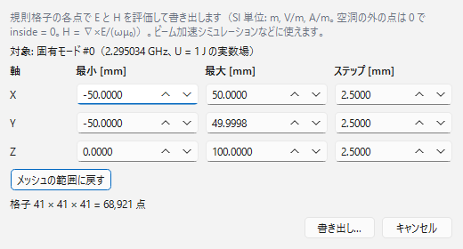

| 項目 | 内容 |
|---|---|
| 単位 | SI（座標 m、E [V/m]、H [A/m]） |
| 固有モード | U = 1 J に規格化した **実数** の場 |
| スナップショット | 1 W 入射（a_inc = 1）に規格化した **複素数** の場（実部と虚部。位相のスライダは関係しません） |
| 空洞の外の点 | E = H = 0、`inside` = 0 |

## 15. 困ったとき

| 症状 | 対処 |
|---|---|
| メッシュタブで作ったのに、解析でまたメッシュを作っている | メッシュを作ったあとに領域名・境界条件・メッシュの設定を変えると、メッシュは「要再生成」になり、解析のときに作り直されます。先に物理タブで領域名と境界条件を決めてからメッシュを作ってください |
| 誘電体のつもりのボディが無い（ボディが 1 つだけ）| 2 つ目からの立体は操作の既定が「結合」なので、前のボディと 1 つになっています。フィーチャーを編集して操作を **新規ボディ** にしてください（[10 章](#ボディと領域名)） |
| メッシュ生成で「… に一致する CAD 面が見つかりません」 | 形を変えたあとで、境界条件の面が見つからなくなっています。ブラウザの「物理 > 境界条件」で ⚠ の付いたグループの面を選び直してください |
| メッシュ生成で「… に指定された面は、重なった別のボディの中に入っていて境界になりません」 | その面は、ほかのボディの中に入った領域の界面です。境界条件は外側の面に付けてください |
| モード数が指定より少ない | f_est を目的の周波数の少し下にしてください（自動でも 1.4 倍ずつ上げて探し直します） |
| スイープで「カットオフ以下」の警告 | その周波数ではポートの導波管が伝搬しません。S は振幅比になり \|S11\|²+\|S21\|² = 1 は成り立ちません。伝搬する帯域だけ見るなら、開始周波数を遮断周波数より上に |
| 共振探索で「最大がスイープの端」 | 範囲を広げて、共振をまたぐようにしてください（精密化は自動なので、点数は少なくてかまいません） |
| キャンセルがすぐ効かない | 1 回の求解の途中では止まりません（次の段階か周波数点で止まる）。すぐに止めるには **強制停止** |
| 「子プロセスが異常終了しました」 | メッシュ生成と解析は別のプロセスなので、アプリは落ちません。極端に小さいメッシュサイズや壊れた CAD ファイルを見直してください（ログに詳細） |
| フィレットで「半径が隣の面の幅（d mm）を超えています」 | 半径を d 以下に（両側から付けるなら合計を d 以下に）。面を使い切る半径ちょうどまでは作れます |
| フィレットが「作成できません」 | 面を使い切る場合は、消える面が平面か円筒で、その向こう側が平面のときに作れます。エッジを減らすか半径を小さくしてください |
| 回転で「軸が平面内にない」「軸が閉領域をまたぐ」 | 軸は平面内の座標軸かスケッチの線にし、閉領域の外側（か境界）に置いてください |
| 「拘束が矛盾するため追加できません」 | いまの拘束と両立しません。自由度が 0 の要素にはそれ以上付けられません |
| CAD 取り込みで「ファイルが見つかりません」 | 取り込んだファイルはプロジェクトの `cad\` にコピーされています。プロジェクトを保存する前に元のファイルを動かした場合は、「取り込み」フィーチャーを編集してファイルを選び直してください |
| IGES の取り込みで「ソリッドがありません」 | 面が閉じていない（隙間がある）IGES です。元の CAD で STEP（ソリッド）として書き出すのが確実です |
| 右パネルの一部が切り替えた言語にならない | 次の起動から切り替わります |
| 画面の配置が崩れた | 「表示」タブの **レイアウトを初期状態に戻す** |

できないこと: STL の取り込み（面を選べないため）、メッシュファイル（.msh）を直接開いての解析、多ポートの Q。

## 付録

### A. リボンのボタン一覧

アイコン・名前・説明の一覧は [manual/ribbon_buttons.md](manual/ribbon_buttons.md)（アプリのツールチップと同じ説明）。

### B. キーボードショートカット

| キー | 3D ビュー | スケッチ画面 |
|---|---|---|
| Esc | 選択の解除・面の選択待ちや入力のキャンセル | 道具のキャンセル → 選択の道具に戻る |
| F | 全体表示 | 全体表示 |
| Enter | | 線分などの入力の終了、数値入力の確定 |
| Delete / Backspace | | 選んだものの削除 |
| S / L / R / C / A / P | | 選択 / 線分 / 長方形 / 円 / 円弧 / 多角形 |
| Ctrl+Z / Ctrl+Y | 元に戻す / やり直し | 同左 |
| Ctrl+N / Ctrl+O / Ctrl+S / Ctrl+Shift+S | 新規 / 開く / 保存 / 名前を付けて保存 | 同左 |

### C. コマンドライン

GUI と同じ計算を、コマンドラインから実行できます（`Cav3D-Studio.exe --help` で一覧）。

```bash
Cav3D-Studio.exe solve <ジョブフォルダ>
```

```bash
Cav3D-Studio.exe mesh <CADファイル>
```

`Cav3D-Studio.exe solve` は、ジョブフォルダの `model.step`（領域名付きの STEP）と `job.json`（解析の設定）から解析します。
この 2 つは「ファイル」タブの **STEP 書き出し** と **job.json 書き出し** で作れます。ほかに `export`（書き出し）、
`run-cavity` / `run-driven`（Cavity3D-FEM の固有モード / スイープの CLI）、`selftest`（動作確認）などがあります。

`job.json` の例（ポートスイープ + 共振探索）:

```json
{
  "schemaVersion": 1, "kind": "sweep", "units": "mm", "name": "coupler",
  "regions": [{"name": "Vacuum", "epsR": 1.0, "muR": 1.0, "meshSize": null}],
  "boundaries": [{"name": "PORT1", "kind": "port",
                  "faces": [{"centroid": [0.0, 11.43, 5.08], "area": 232.26, "normal": [-1, 0, 0]}]}],
  "mesh": {"sizeMm": 5.0, "order": 2},
  "solver": {"numModes": 1, "basisOrder": 2, "fEstGHz": null, "sigmaWall": 5.8e7},
  "sweep": {"fStartGHz": 7.4, "fStopGHz": 8.4, "nFreq": 401, "adaptive": true,
            "tol": 0.001, "maxSolves": 40, "findResonance": true},
  "outputs": {"vtk": false}
}
```

境界の面は、重心 [mm] と面積 [mm²] で CAD の面と照らし合わせます。

### D. 結果フォルダの中身

```
model.step / job.json                   入力（領域名付きの STEP と解析の設定）
model.msh / model.msh.materials.json    メッシュ（gmsh 形式。領域名・境界名付き）と材料
model_result.h5 / frequencies.csv       固有モードの結果（「結果ファイルを開く…」でも開ける）
model_sweep.h5 / s_params.csv           スイープの結果
snapshots.h5                            場のスナップショット（共振点の場を含む）
resonance.json / summary.json / log.txt 共振探索の結果・要約・ログ
```

### E. 規格化と物理量

| 量 | 意味 |
|---|---|
| U = 1 J | 固有モードの場は、蓄積エネルギー（電場と磁場の和）が 1 J になるように規格化してあります |
| P [W] | U = 1 J のときの損失（壁の表面抵抗による損失 + 誘電体損失）。Q = ω0U/P |
| Q_wall / Q_diel | 壁損失だけ / 誘電体損失だけの Q。1/Q = 1/Q_wall + 1/Q_diel。誘電体損失は P_diel = (ωε0/2)∫εr tanδ\|E\|²dV（摂動） |
| G [Ω] | 幾何因子 G = Q_wall·Rs（Rs は壁の表面抵抗）。形だけで決まる |
| 残差 | 固有値問題の相対残差。正常なら 1e-10 程度以下 |
| η | スプリアス（ニセのモード）の目安。本物のモードは ≈ 1 |
| a_inc = 1 | スイープとスナップショットの規格化。ポートの基本モードで 1 W 入射 |
| U/P_inc [J/W] | 入射電力あたりの蓄積エネルギー。共振で最大になり、Qe = ω0U/(4P_inc) |

### F. 関連ドキュメント

- 配布ページ（ダウンロード・説明・問い合わせ）: https://github.com/TakuyaNatsui/Cav3D-Studio
- 使用許諾: アプリのフォルダの `EULA.ja.txt`（正本）/ `EULA.en.txt`（英訳）
- 同梱物のライセンス: アプリのフォルダの `THIRD_PARTY_NOTICES.txt`、メッシュ生成のプログラム（GPL）は `mesher\` の
  `README.txt`
- 不具合の報告・質問: https://github.com/TakuyaNatsui/Cav3D-Studio/issues
