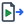
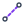
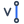
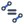
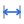
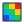
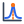
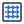

# リボンのボタン一覧

（説明はアプリのボタンのツールチップと同じです）

## ファイル

| | ボタン | 説明 |
|---|---|---|
|  | 新規 | 新しいプロジェクトを始めます（保存していない変更があれば確認します） |
|  | 開く… | プロジェクト（.cv3dproj）かモデル（.emcad.json）を開きます |
|  | 最近使ったファイル | 最近使ったプロジェクトを開きます |
|  | 保存 | プロジェクトを保存します（初めてなら保存先を聞きます）。取り込んだ CAD はプロジェクトにコピーします |
|  | 名前を付けて保存… | 別の名前で保存します（データフォルダの CAD・メッシュ・結果ごと複製） |
|  | 元に戻す (Ctrl+Z) | 直前の変更を取り消します |
|  | やり直し (Ctrl+Y) | 取り消した変更をやり直します |
|  | CAD 取り込み | STEP・IGES・BREP を取り込み、ソリッドごとにボディを作ります（ファイルはプロジェクトにコピー） |
|  | モデル書き出し (.emcad.json) | モデル（形状と解析設定）だけをブラウザ版と同じ形式（.emcad.json）で書き出します |
|  | STEP 書き出し | ボディを名前付きの STEP で書き出します（CLI の emcad solve 用） |
|  | job.json 書き出し | 解析設定を job.json で書き出します（CLI の emcad solve 用） |
|  | 言語 ja/en | 表示の言語を日本語 / 英語で切り替えます |

## モデリング

| | ボタン | 説明 |
|---|---|---|
|  | XY 平面 | XY 平面に新しいスケッチを作って 2D 画面に入ります |
|  | YZ 平面 | YZ 平面に新しいスケッチを作って 2D 画面に入ります |
|  | XZ 平面 | XZ 平面に新しいスケッチを作って 2D 画面に入ります |
|  | 面を選択 | 3D ビューでボディの平らな面をクリックし、その面の上にスケッチを作ります（面の輪郭を自動で投影） |
|  | 押し出し | スケッチの閉領域を押し出してボディを作ります（新規 / 結合 / 切り取り / 交差） |
|  | 回転 | スケッチの閉領域を軸のまわりに回転させてボディを作ります |
|  | 直方体 | 直方体を作ります（大きさと位置を入力） |
|  | 円柱 | 円柱を作ります（底面の中心から Z 方向） |
|  | 球 | 球を作ります |
|  | フィレット | ボディのエッジを丸めます（面を使い切る半径まで可。Ctrl+クリックでループ選択） |
|  | 面取り | ボディのエッジを面取りします |
|  | シェル | ボディを指定した肉厚の殻にします（選んだ面が開口になります） |
|  | 結合 | ボディどうしの結合 / 切り取り / 交差 |
|  | ミラー | ボディを原点平面で鏡映します |
|  | 作業平面 | スケッチ用の作業平面を作ります（原点平面・作業平面・面からのオフセット） |
|  | パラメータ | 寸法や距離の式に使う名前付きパラメータ（例 L = 2*R + 5）を編集します |

## モデリング（スケッチ編集中）

| | ボタン | 説明 |
|---|---|---|
|  | 選択 | クリックで選択（Shift で追加）、ドラッグで移動、Delete で削除。寸法の値はダブルクリックで編集 |
|  | 線分 | 始点 → 次の点…と続けて描きます。Enter か右クリックで終了 |
|  | 長方形 | 1 つ目の角 → 対角。4 辺に水平 / 垂直の拘束が付きます |
|  | 円 | 中心 → 円周上の点（半径は数値入力も可） |
|  | 円弧 | 中心 → 始点 → 終点（始点から反時計回り） |
|  | 多角形 | 中心 → 頂点。辺の数は右のパネルで指定します |
|  | 点 | 点を置きます |
|  | フィレット | 2 本の線が接する角（点）か線 2 本をクリックして角を丸めます。半径は右のパネル |
|  | 構築線 | 選択した線・円・円弧を構築ジオメトリ ⇄ 通常 に切り替える（構築ジオメトリは閉領域に使われない） |
|  | ジオメトリ投影 | 3D ビューでボディのエッジや面をクリックしてスケッチ平面へ投影する（モデルを変えると追従する） |
|  | 原点 | 原点をスケッチ面に投影します（固定点） |
|  | X 軸 | X 軸をスケッチ面に投影します（構築線） |
|  | Y 軸 | Y 軸をスケッチ面に投影します（構築線） |
|  | Z 軸 | Z 軸をスケッチ面に投影します（構築線） |
|  | 一致 | 一致: 2 点を統合（点 → 線/円/円弧なら点を曲線上に） |
|  | 水平 | 水平: 線をクリック |
|  | 垂直 | 垂直: 線をクリック |
|  | 平行 | 平行: 線を 2 本 |
|  | 直交 | 直交: 線を 2 本 |
|  | 接線 | 接線: 線と円/円弧，または円/円弧同士 |
|  | 等長 | 等長/等半径: 線 2 本または円/円弧 2 つ |
|  | 同心 | 同心: 円/円弧を 2 つ |
|  | 固定 | 固定: 点をクリック |
|  | 対称 | 対称: 点 2 つと対称軸の線 |
|  | 点を曲線上に | 点を曲線上に: 点，次に線/円/円弧 |
|  | 寸法 | 寸法: 円/円弧で半径，2 点で距離，点と線で距離，平行な線 2 本で間の距離，線 2 本で角度，線で長さ（Enter） |
|  | パラメータ | 寸法や距離の式に使う名前付きパラメータ（例 L = 2*R + 5）を編集します |
|  | 全体表示 | 全体が入るように表示します |

## 物理

| | ボタン | 説明 |
|---|---|---|
|  | PEC | 完全導体壁（E_tan = 0，壁損失 Q の対象）．未割り当ての外面は自動的に PEC |
|  | E-short | 対称電気壁（E_tan = 0，損失に含めない）．半分モデルの切断面など |
|  | M-short | 対称磁気壁 PMC（自然境界）．半分モデルの切断面など |
|  | ポート | ウェーブポート面（PORT1, PORT2, …）．固有モード解析では自然境界として扱う |

## メッシュ

| | ボタン | 説明 |
|---|---|---|
|  | メッシュ生成 | メッシュだけを作って要素数・品質と境界メッシュを確認します（設定が同じなら解析で使い回します） |
|  | 中止 | メッシュの生成を中止します |
|  | 境界メッシュ | 作ったメッシュの境界を境界条件の色で 3D ビューに表示します |

## 解析

| | ボタン | 説明 |
|---|---|---|
|  | 解析実行 | 設定を確認してから解析を実行します（実行の前にプロジェクトを保存します） |
|  | キャンセル | キャンセルは次の段階または次の周波数点で反映されます |
|  | 強制停止 | 解析の子プロセスをすぐに終了します（固有値計算の途中でも止まる。その解析の結果は残りません） |

## 結果

| | ボタン | 説明 |
|---|---|---|
|  | 結果表示 | 解析結果（場と境界メッシュ）を 3D ビューに重ねて表示します |
|  | S パラメータ | S パラメータ図を別ウィンドウで開きます / 閉じます |
|  | E | 表示する場（E / H / J = 壁面の表面電流 Js = n × H。J を選ぶと表示方法は壁面になる） |
|  | H | 表示する場（E / H / J = 壁面の表面電流 Js = n × H。J を選ぶと表示方法は壁面になる） |
|  | J | 表示する場（E / H / J = 壁面の表面電流 Js = n × H。J を選ぶと表示方法は壁面になる） |
|  | 全体 | 全体 = 3D 格子の矢印 / 断面 = 断面上の矢印 + ヒートマップ / 全要素 = 要素重心の矢印 / 壁面 = PEC 壁の色と矢印（E: 壁面の電場、H: 壁面の磁場、J: 表面電流 Js = n × H） |
|  | 断面 | 全体 = 3D 格子の矢印 / 断面 = 断面上の矢印 + ヒートマップ / 全要素 = 要素重心の矢印 / 壁面 = PEC 壁の色と矢印（E: 壁面の電場、H: 壁面の磁場、J: 表面電流 Js = n × H） |
|  | 全要素 | 全体 = 3D 格子の矢印 / 断面 = 断面上の矢印 + ヒートマップ / 全要素 = 要素重心の矢印 / 壁面 = PEC 壁の色と矢印（E: 壁面の電場、H: 壁面の磁場、J: 表面電流 Js = n × H） |
|  | 壁面 | 全体 = 3D 格子の矢印 / 断面 = 断面上の矢印 + ヒートマップ / 全要素 = 要素重心の矢印 / 壁面 = PEC 壁の色と矢印（E: 壁面の電場、H: 壁面の磁場、J: 表面電流 Js = n × H） |
|  | X | 断面の軸（位置は右パネルのスライダ） |
|  | Y | 断面の軸（位置は右パネルのスライダ） |
|  | Z | 断面の軸（位置は右パネルのスライダ） |
|  | 断面に正対 | 断面に正対する向きから見ます |
|  | 2D 断面図 | 3D の断面と同じ場を平面図で表示（座標と値の読み取り付き。別ウィンドウ） |
|  | 矢印 | 場の向きと強さを矢印で表示します |
|  | ヒートマップ | 断面の場を色で表示します（色で表す量は右のパネル） |
|  | 境界メッシュ | 解析に使った境界メッシュを境界条件の色で表示します |
|  | 共振探索 | 1 ポートのスイープ結果から共振点 f0 と Qe・Q0・QL を求める（スイープは解き直さない。結果はこの結果に追記） |
|  | 共振点の場 | 共振探索で求めた f0 の駆動場（スナップショット）を表示します |
|  | 結果の書き出し… | 固有モード: frequencies.csv と各モードの場（VTK）。スイープ: S パラメータ（CSV と Touchstone .sNp） |
|  | フィールドマップ… | 選んでいるモード / スナップショットの E・H を規則格子で評価して HDF5 / CSV に書き出す（ビーム計算用） |
|  | プロジェクト外の結果フォルダを開く… | プロジェクトに入っていない結果のフォルダ（CLI の出力など）を開きます |
|  | 結果ファイルを開く… | 旧 wx GUI や CLI の結果（*_result.h5 / *_sweep.h5）を表示専用で開く（場の表示・2D 断面図・書き出し・フィールドマップ） |

## 表示

| | ボタン | 説明 |
|---|---|---|
|  | ホーム | 既定の視点（等角）に戻します |
|  | 上面 | 上（+Z）から見ます |
|  | 正面 | 正面（−Y）から見ます |
|  | 右側面 | 右（+X）から見ます |
|  | 等角 | 斜め上から見ます（等角） |
|  | 全体表示 | 全体が入るように表示します |
|  | 透視投影 | オンで透視投影、オフで平行投影（奥の物体も同じ大きさで表示） |
|  | レイアウトを初期状態に戻す | ブラウザ・プロパティ・ログの配置と、2D 断面図・S パラメータ図のウィンドウの位置を初期状態に戻します |

「スケッチ終了」は緑の大きなボタン（リボンの左端とスケッチ画面の右上）。E / H・X / Y / Z は文字だけの切り替えボタン。
